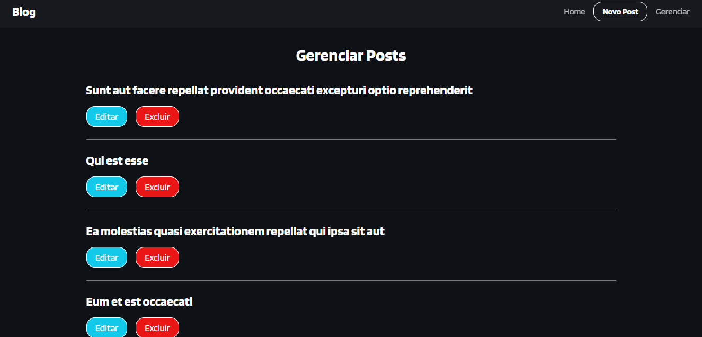

# Blog com React e Axios

Nesse projeto utilizamos o conceito de (CRUD) que é o elemento base da interação do usuário com o blog.  
Outras tecnologias, como "Axios" e o "React Router Dom" que executa as rotas de mudança de páginas, fazem parte do projeto. 
Utilizamos uma API externa no projeto (JSON Placeholder) para importar os dados de exibição.  
Ao acessarmos a HOME é realizado o "Get" de todos os posts na API:  

  
No acesso de um único post é feito o GET com base no ID que foi enviado pela função e esse post é exibido na tela:  

  
No clique do botão "Novo Post" podemos inserir um novo post  

  
Em gerenciar temos as opções de editar e excluir posts.  

